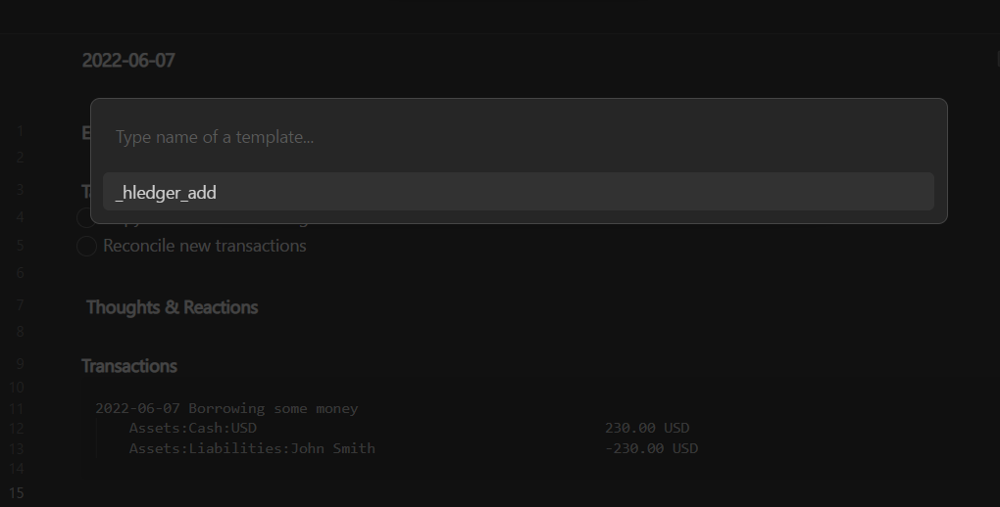
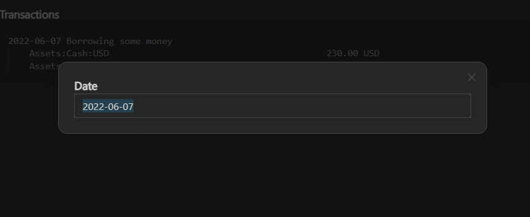
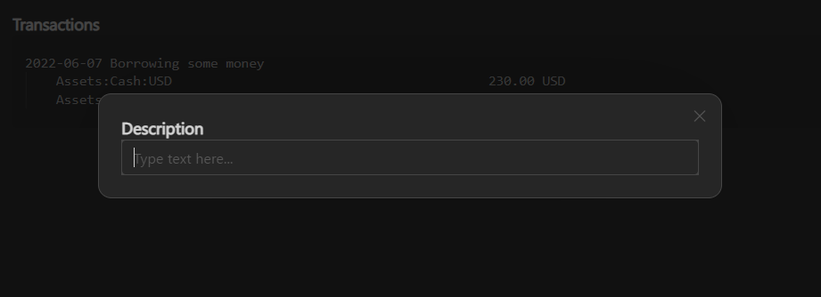
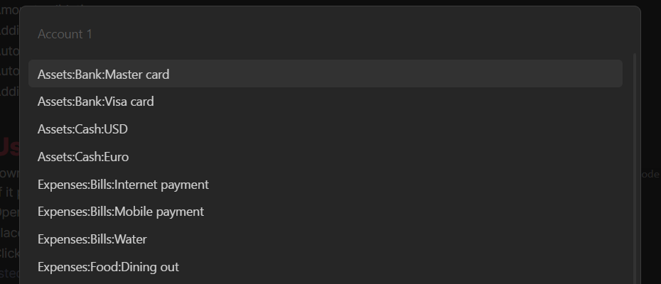
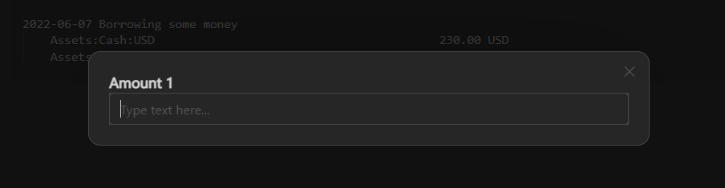
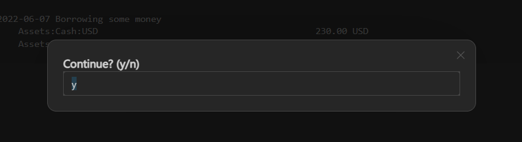
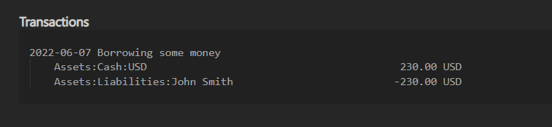

# About this repository
In this obisidian vault I implemented add transaction to hledger file or daily note functionality using Templater.
This readme file assumes you know how to use Obsidian and you are already familiar with hledger.

# Features
- Autocompleting accounts
- Autodetecting transaction date from daily note
- Adding multiple transactions at once
- Autocalculating amounts
- Amount validation
- Adding amount with shortcuts, e.g. 13k instead of 1,300 or 24m instead of 24,000,000
- Autoformatting amounts as currency
- Autoformatting transaction line width
- Adding transaction to daily note as code-snippet to make copying transaction easier

# User manual
1. Download this repository and open the folder obsidian_hledger on Obsidian as a vault and choose `Turn safe mode off` if it prompts to disable community plugins.
2. Open any date from Calendar panel and create daily note.
3. Place cursor after heading **Transactions**.
4. Click `ALT+E` and choose `_hledger_add`:

5. Enter a date or just click Enter:

6. Write description or just click Enter:

7. Type account name or choose from dropdown:

8. Enter amount. Valid inputs: 1000, 1,000, 1k, 1000$, 1000 USD, 1000USD, 10000.23 $

9. Repeat for Account 2 and Amount 2.
10. Click Enter if you want to add more transactions:

11. You can see the final output like this:

# Limitations
- Prefix commodities are not supported
- Balance correctness won't be checked
- Exchange rates won't be parsed on conversions

# Q&A
- **Why journal file, accounts file are in `.md` file format?**
	I discovered on [hledger's manual page](https://hledger.org/1.25/hledger.html#data-formats) that hledger detects the format automatically based on the file extensions shown above. If it can't recognise the file extension, it assumes journal format. So, `.md` format is ok for hledger
- **Why do you keep hledger journal files in your Obsidian vault?**
	I use Git plugin for my Obsidian vault and backuping my vault guarantees my journals are version controlled and safe. Also, it is easier to search something in my journal files via Obsidian search.

## Diclaimer
I am Python Developer and I don't have much experience in Javascript. So, I might did some stupid mistakes on my javascript code in `_hledger_add` file. Feel free to correct my mistakes or contribute to this repository.